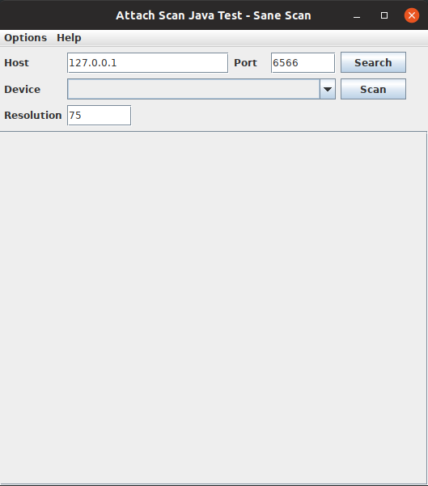
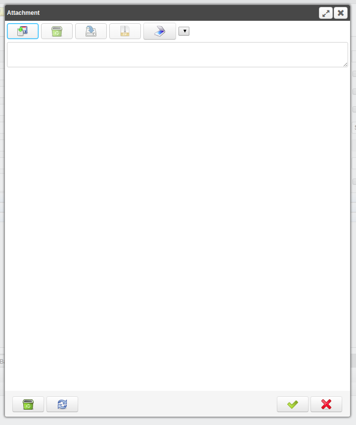

# Attach Scan iDempiere plugin

This plugin implement the interface 'sane' to scan directly from iDempiere.

## Features

- Copyright: 2020 INGEINT (http://www.ingeint.com)
- Repository: https://github.com/ingeint/idempiere-attachscan-plugin

### Testing Gui

Run It:
```
cd attachscan-gui
./gradlew run
```



### Plugin

Compile plugin:
```
cd attachscan-plugins
./build
```

Then install it in iDepiere.

Toolbar:


Window:


## Extra Links
-------------
- [Documentation](http://wiki.idempiere.org/en/Plugin:_Attachment_Scanner)
- [Sane Project](http://www.sane-project.org/)
- [Sane](http://es.wikipedia.org/wiki/Scanner_Access_Now_Easy)
- [iDempiere Toolbar Button](http://wiki.idempiere.org/en/NF1.0_CustomWindowToolbarButton)
